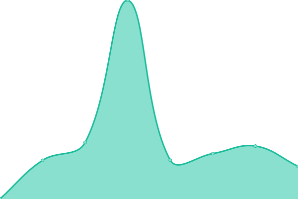
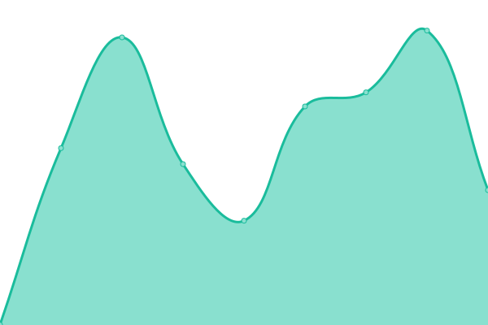

# [📈 Live Status](https://blastillroid.github.io/slashuptime): <!--live status--> **🟩 All systems operational**

This repository contains the open-source uptime monitor and status page for [Missaoui Mounir](https://blastillroid.github.io/slashuptime), powered by [Upptime](https://github.com/upptime/upptime).

With [Upptime](https://upptime.js.org), you can get your own unlimited and free uptime monitor and status page, powered entirely by a GitHub repository. We use [Issues](https://github.com/blastillroid/slashuptime/issues) as incident reports, [Actions](https://github.com/blastillroid/slashuptime/actions) as uptime monitors, and [Pages](https://blastillroid.github.io/slashuptime) for the status page.

<!--start: status pages-->
<!-- This summary is generated by Upptime (https://github.com/upptime/upptime) -->
<!-- Do not edit this manually, your changes will be overwritten -->
<!-- prettier-ignore -->
| URL | Status | History | Response Time | Uptime |
| --- | ------ | ------- | ------------- | ------ |
|  [Obimo](https://obimo.io) | 🟩 Up | [obimo.yml](https://github.com/BlastillROID/slashuptime/commits/HEAD/history/obimo.yml) | 

 472ms
     
 | 

<a href="https://upptime.slashup.studio/history/obimo">100.00%</a>
    

|  [SlashUp](https://slashup.studio) | 🟩 Up | [slash-up.yml](https://github.com/BlastillROID/slashuptime/commits/HEAD/history/slash-up.yml) | 

 698ms
     
 | 

<a href="https://upptime.slashup.studio/history/slash-up">100.00%</a>
    

<!--end: status pages-->

[**Visit our status website →**](https://blastillroid.github.io/slashuptime)

## 📄 License

- Powered by: [Upptime](https://github.com/upptime/upptime)
- Code: [MIT](./LICENSE) © [Missaoui Mounir](https://blastillroid.github.io/slashuptime)
- Data in the `./history` directory: [Open Database License](https://opendatacommons.org/licenses/odbl/1-0/)
